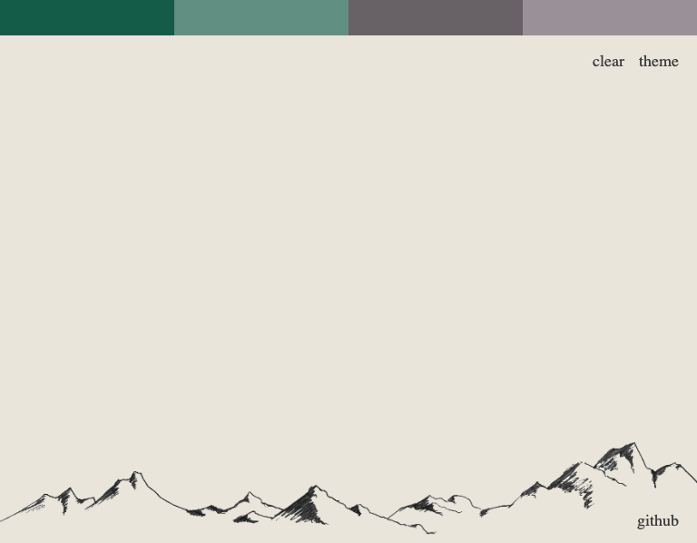
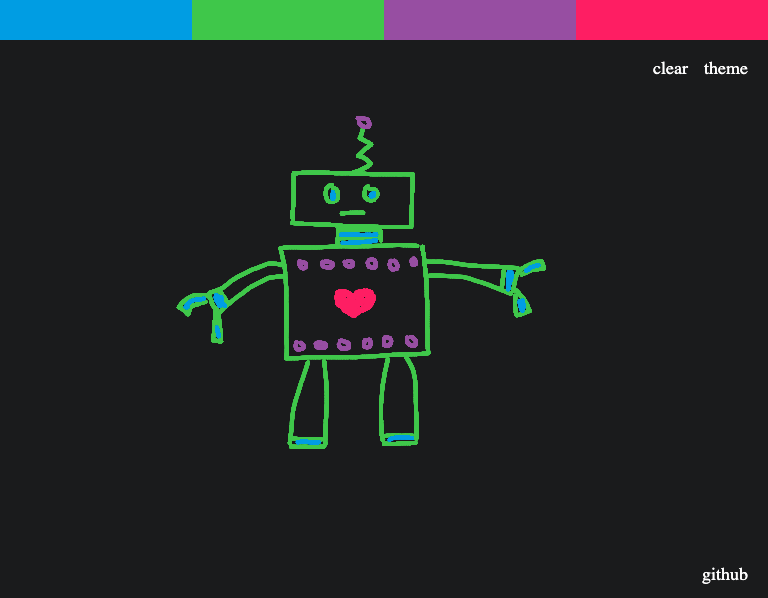
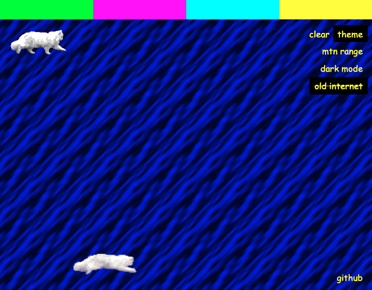

# Computer Crayon

A freeform drawing app with multiple color/background themes, that works on both desktop and mobile devices.

## Demo

[Live Demo](https://www.jenniferkerssen.com/computer-crayon/)

## Requirements
### Users should be able to... 
* create freeform drawings on desktop or touch-screen devices.
* choose line colors.
* choose color/background themes.
* erase the canvas without refreshing the page.
* access the app's github page.

## Built With
* Canvas API
* JavaScript
* HTML
* CSS

## Screenshots

Mtn Range Theme

Dark Mode Theme
 

Old Internet Theme
 